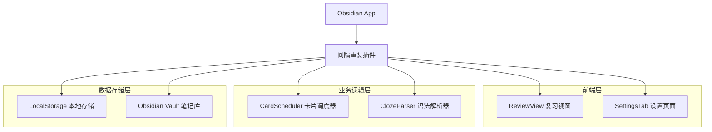
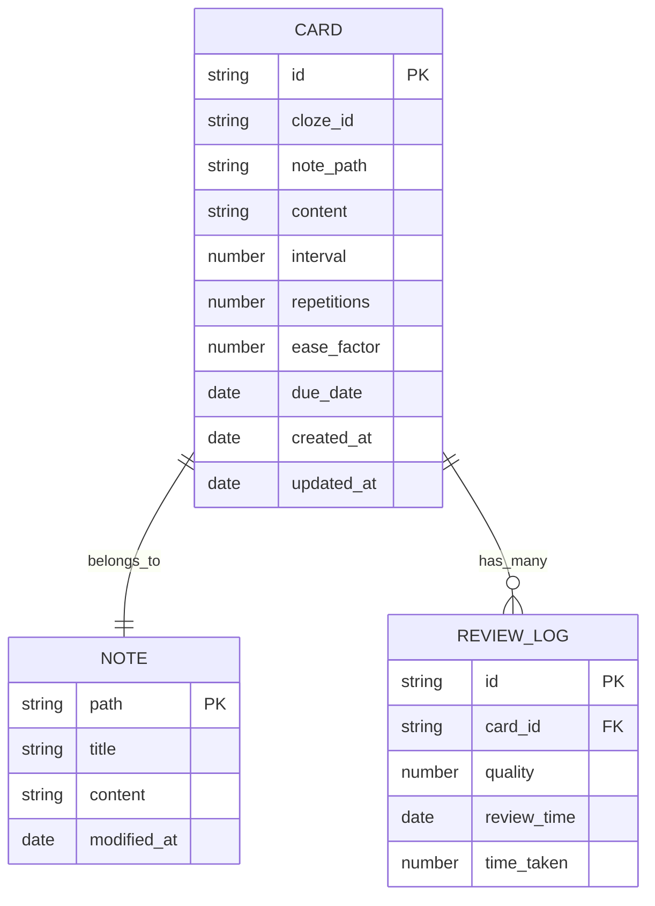

# 间隔重复插件技术架构文档

## 1. Architecture design



## 2. Technology Description

- Frontend: TypeScript + Obsidian API + CSS3
- Backend: None (纯前端插件)
- Storage: Obsidian 本地数据存储 + LocalStorage

## 3. Route definitions

| Route | Purpose |
|-------|---------|
| ReviewView | 主要复习界面，显示上下文化的卡片复习 |
| SettingsTab | 插件设置页面，配置复习参数和 Cloze 语法 |
| StatsModal | 统计弹窗，显示复习数据和学习进度 |

## 4. API definitions

### 4.1 Core API

由于这是一个纯前端 Obsidian 插件，主要通过内部方法调用实现功能：

**卡片调度相关**
```typescript
interface Card {
    id: string;
    clozeId: string;
    notePath: string;
    content: string;
    interval: number;
    repetitions: number;
    easeFactor: number;
    dueDate: Date;
}

interface ReviewResult {
    cardId: string;
    quality: number; // 0: skip, 1: forgot, 3: remembered
    reviewTime: Date;
}
```

**复习调度器方法**
```typescript
class CardScheduler {
    getNextCard(): Promise<Card | null>
    reviewCard(card: Card, quality: number): Promise<void>
    getDueCards(): Promise<Card[]>
    getStats(): Promise<ReviewStats>
}
```

**Cloze 解析器方法**
```typescript
class ClozeParser {
    parseNote(content: string): ClozeCard[]
    extractClozes(text: string): ClozeMatch[]
    renderWithCloze(content: string, activeId: string): string
}
```

## 5. Data model

### 5.1 Data model definition



### 5.2 Data Definition Language

由于 Obsidian 插件使用本地存储，这里提供数据结构定义：

**卡片数据结构 (存储在 data.json)**
```typescript
interface PluginData {
    cards: {
        [cardId: string]: {
            id: string;
            clozeId: string;
            notePath: string;
            content: string;
            interval: number;
            repetitions: number;
            easeFactor: number;
            dueDate: string; // ISO date string
            createdAt: string;
            updatedAt: string;
        }
    };
    reviewLogs: {
        [logId: string]: {
            id: string;
            cardId: string;
            quality: number;
            reviewTime: string;
            timeTaken: number;
        }
    };
    settings: {
        maxReviewsPerDay: number;
        clozePattern: string;
        reviewStartHour: number;
        reviewEndHour: number;
    };
}
```

**初始化数据**
```typescript
const DEFAULT_DATA: PluginData = {
    cards: {},
    reviewLogs: {},
    settings: {
        maxReviewsPerDay: 50,
        clozePattern: "{{c(\\d+)::(.*?)}}",
        reviewStartHour: 6,
        reviewEndHour: 22
    }
};
```

**假数据示例**
```typescript
const MOCK_CARDS: Card[] = [
    {
        id: "card-1",
        clozeId: "c1",
        notePath: "物理学/相对论.md",
        content: "广义相对论-爱因斯坦的理论认为{{c1::引力}}是时空弯曲的表现。",
        interval: 1,
        repetitions: 0,
        easeFactor: 2.5,
        dueDate: new Date()
    },
    {
        id: "card-2", 
        clozeId: "c1",
        notePath: "哲学/存在主义.md",
        content: "萨特认为{{c1::存在先于本质}}是存在主义的核心观点。",
        interval: 3,
        repetitions: 1,
        easeFactor: 2.6,
        dueDate: new Date(Date.now() + 24 * 60 * 60 * 1000)
    }
];
```