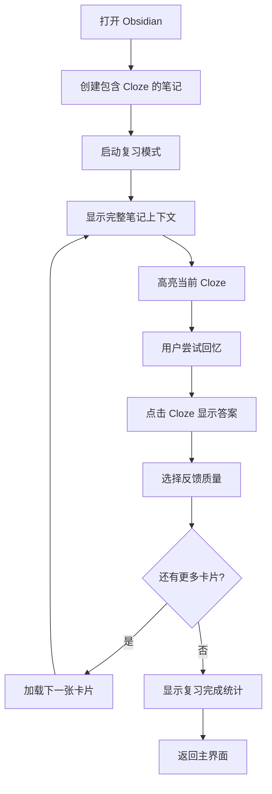

# 间隔重复复习插件产品需求文档

## 1. Product Overview

本插件是一个基于 Obsidian 的智能间隔重复复习系统，采用"上下文复习"的创新理念。与传统的孤立卡片复习（如 Anki）不同，用户在复习时看到的是完整的笔记内容，插件只是高亮需要回忆的部分，提供更好的学习上下文和记忆效果。

- 核心目标：通过上下文化的复习方式，提高知识点的记忆效果和理解深度
- 目标用户：使用 Obsidian 进行知识管理和学习的用户，特别是需要长期记忆大量知识点的学生、研究者和知识工作者

## 2. Core Features

### 2.1 User Roles

| 角色 | 注册方式 | 核心权限 |
|------|----------|----------|
| Obsidian 用户 | 安装插件 | 可以创建和复习 Cloze 卡片，查看复习统计 |

### 2.2 Feature Module

我们的间隔重复插件包含以下主要页面：

1. **复习界面**：上下文复习视图，显示完整笔记内容，高亮 Cloze 填空
2. **设置页面**：插件配置选项，复习参数调整
3. **统计页面**：复习进度统计，学习数据分析

### 2.3 Page Details

| Page Name | Module Name | Feature description |
|-----------|-------------|---------------------|
| 复习界面 | 顶部导航栏 | 显示返回按钮、卡片计数器（如"42 + 0"）、标题"Flashcards"、面包屑导航显示当前笔记路径 |
| 复习界面 | 主要内容区域 | 渲染完整的 Markdown 笔记内容，高亮显示当前需要复习的 Cloze 填空，支持滚动浏览 |
| 复习界面 | Cloze 交互 | 点击隐藏的 Cloze 显示答案，支持多个 Cloze 在同一笔记中，每个 Cloze 有唯一标识 |
| 复习界面 | 底部反馈控制栏 | 提供三个反馈按钮：Skip（跳过）、Forgot（忘记）、Remembered（记住），用于 SM-2 算法调度 |
| 设置页面 | 复习参数配置 | 设置每日复习数量限制、复习时间段、难度调整参数 |
| 设置页面 | Cloze 语法配置 | 配置 Cloze 语法格式（如 {{c1::内容}}），自定义样式主题 |
| 统计页面 | 复习数据展示 | 显示今日复习数量、正确率、连续复习天数、各难度级别卡片分布 |
| 统计页面 | 学习曲线 | 展示学习进度图表，记忆保持率统计，复习效果分析 |

## 3. Core Process

**主要用户操作流程：**

1. 用户在 Obsidian 笔记中使用 Cloze 语法（如 `{{c1::引力}}`）创建填空题
2. 插件自动解析笔记中的 Cloze 语法，生成复习卡片
3. 用户通过命令面板或侧边栏图标打开复习界面
4. 系统根据 SM-2 算法调度，显示需要复习的卡片
5. 用户在完整笔记上下文中看到高亮的 Cloze 填空
6. 用户尝试回忆答案，然后点击 Cloze 查看正确答案
7. 用户根据回忆效果选择反馈（Skip/Forgot/Remembered）
8. 系统更新卡片的复习间隔，自动加载下一张卡片
9. 复习完成后显示统计信息

## 4. User Interface Design

### 4.1 Design Style

- **主色调**：采用 Obsidian 主题适配的颜色变量，主要使用 `--background-primary` 和 `--background-secondary`
- **强调色**：Cloze 隐藏状态使用蓝色高亮 `#a5d8ff`，显示答案时使用绿色 `#2a9d8f`
- **按钮样式**：圆角矩形按钮，悬停时有轻微阴影效果
- **字体**：使用系统默认 sans-serif 字体，行高 1.7 保证良好的阅读体验
- **布局风格**：采用 Flexbox 垂直布局，顶部导航栏固定，中间内容区可滚动，底部控制栏固定
- **图标风格**：使用简洁的文本符号（如 « 返回，... 更多选项）

### 4.2 Page Design Overview

| Page Name | Module Name | UI Elements |
|-----------|-------------|-------------|
| 复习界面 | 顶部导航栏 | 白色背景，灰色边框，左中右三栏布局，中间显示卡片计数和面包屑导航 |
| 复习界面 | 主要内容区域 | 浅灰色背景，白色内容区，充足的内边距，支持垂直滚动，Markdown 渲染样式 |
| 复习界面 | Cloze 元素 | 隐藏时蓝色背景同色文字，虚线下划线，点击后透明背景绿色文字，平滑过渡动画 |
| 复习界面 | 底部控制栏 | 白色背景，三个等宽按钮水平排列，按钮间距 15px，悬停时背景变浅灰色 |
| 设置页面 | 配置表单 | 标准 Obsidian 设置页面样式，使用 Setting 组件，清晰的标签和描述 |
| 统计页面 | 数据展示 | 卡片式布局，使用图表库展示学习曲线，颜色与主题保持一致 |

### 4.3 Responsiveness

- **桌面优先设计**：主要针对桌面端 Obsidian 使用场景优化
- **移动端适配**：在移动设备上自动调整按钮大小和间距，确保触摸操作友好
- **触摸交互优化**：Cloze 点击区域足够大，反馈按钮支持触摸操作，添加触摸反馈效果